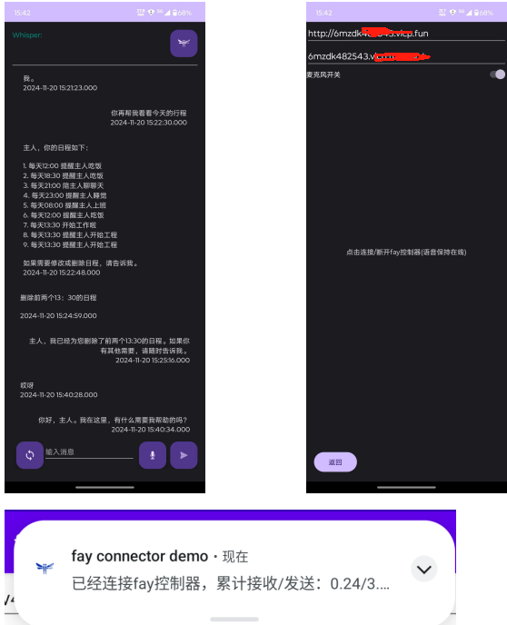
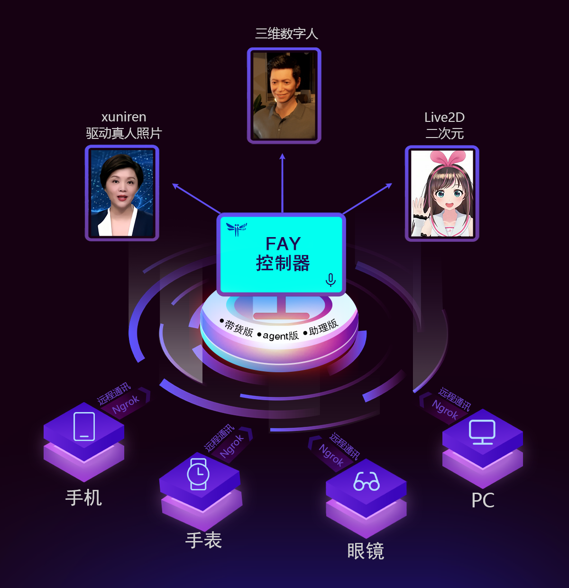

     
    
    <h1>Fay</h1>
	<h3>Fay android 连接器</h3>

连接Fay数字人框架使用，可以实现与Fay的文字及语音消息的收发，更可静默的保持手机后台运行。      
更新日志：https://qqk9ntwbcit.feishu.cn/wiki/UlbZwfAXgiKSquk52AkcibhHngg
使用文档：https://qqk9ntwbcit.feishu.cn/wiki/JzMJw7AghiO8eHktMwlcxznenIg

## **功能特点**

- 完全开源，商用免责
- 支持连接Fay服务器或主机端
- 支持本地whisper语音识别
- 支持与Fay的语音互传
- 支持与Fay的文字消息收发
- 长驻后台运行
- 收发数据量实时显示

###               

## **UI**

## **开发环境**

- android studio 17.0.11
- android sdk 34
- jdk 11

## **配置**

若Fay运行环境中没有ssl，或者是内网机器，或者是穿透使用，请在/res/xml/network_security_config.xml中配置授权host。

## **高级玩法**

### ***搭建Fay***

Fay: https://github.com/xszyou/fay

### ***使用数字人（非必须）***

ue: https://github.com/xszyou/fay-ue5

unity：https://qqk9ntwbcit.feishu.cn/wiki/Se9xw04hUiss00kb2Lmci1BVnM9

metahuman-stream（2d）：https://qqk9ntwbcit.feishu.cn/wiki/Ik1kwO9X5iilnGkFwRhcnmtvn3e

duix（android)：https://qqk9ntwbcit.feishu.cn/wiki/Ik1kwO9X5iilnGkFwRhcnmtvn3e()

aibote(windows cpu克隆人)：[‬‍‬‍⁠‍‍‍‌https://qqk9ntwbcit.feishu.cn/wiki/ULaywzVRti0HXWkhCzacoSPAnIg

### ***集成到自家产品（非必须）***

接口：https://qqk9ntwbcit.feishu.cn/wiki/Mcw3wbA3RiNZzwkexz6cnKCsnhh

### **联系**

**交流群及资料教程**关注公众号 **fay数字人**（**请先star本仓库**）

# 感谢

[vilassn/whisper_android: Offline Speech Recognition with OpenAI Whisper and TensorFlow Lite for Android](https://github.com/vilassn/whisper_android)

